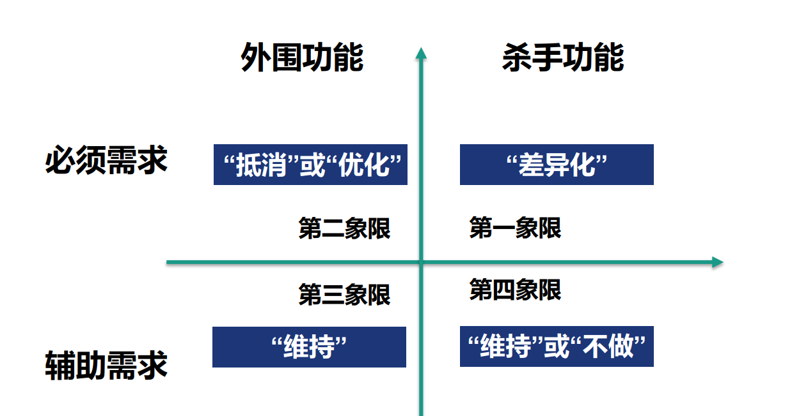

# 总结小组作业需求的“四个象限”
## 小组组成：41911104李婷婷 41911103胡珂 41911094谭慧

## 小组作业主题：

开发一个车载移动移动应用软件。目前准备开发功能如下：
1. 注册，登录，个人信息
2. 可预约加油
3. 地图实时显示当前汽车位置，并显示周围的加油站
4. 根据路况选择路线
5. 维护车辆信息
6. 开车时可听音乐
7. 交通违章信息

## 四象限框架：

1. 杀手功能（core）/外围功能（context）：
+ 杀手功能：为了吸引用户，我们的产品就需要有自己的亮点，这种功能叫做杀手功能。
+ 外围功能：而其他的那些普通产品都具备的功能，虽然也很重要但是都是外围的，叫做外围功能。

2. 必要需求（Mission Critical）/辅助功能（Enabling）：
+ 必要需求：用户提出的明确要完成的需求，没有这些需求，用户不能接受这个产品。
+ 辅助需求：辅助性的功能，比如可以有多种主题界面。

## 总结小组作业需求的“四个象限”如下：
1. 从必要需求而言：
+ 第一象限杀手功能代表我们需要采取“差异化”的办法，全力以赴投资在这个领域，需要有自己的亮点。我们的亮点就在于车辆在行驶过程中，可以显示周围加油站并预约加油，并维护车辆信息，把相应通知及时推送到手机端。如
当服务器端的数据库里记录的汽油量少于20%时，给手机发送通知告诉汽车车主该去加油，当服务器端的数据库里记录的发动机出现异常、变速器出现异常或车灯有坏的时候，给手机发送通知告诉汽车车主需要进行维修等等。

+ 第二象限外围产品代表大家都特别看重的功能。我们应该采取“抵消”：快速地达到足够好、和竞争对手差不多。优化：花大力气做到并保持行业最好。
对于车载软件而言，注册，登录个人信息，根据路况选择路线都是外围产品，是用户的刚需。我们要优化或抵消。

2. 从辅助功能而言：
+ 第三象限外围功能代表我们应当采取“维持”的办法，以最低代价维持此功能。
对于该软件来说，良好的交互界面，能够带来优秀的用户体验，是我们需要进行维持的。

+ 第四象限杀手功能代表我们需要采取“维持”的办法，或者现在“不做”，等待好的时机，或者小规模实验。如
对于车载软件，我们还可加入额外功能，如预约支付（支付宝，微信钱包，银联等）等，它们属于杀手功能，但可以先“维持”或现在“不做”，等待好的时机进行完善。
